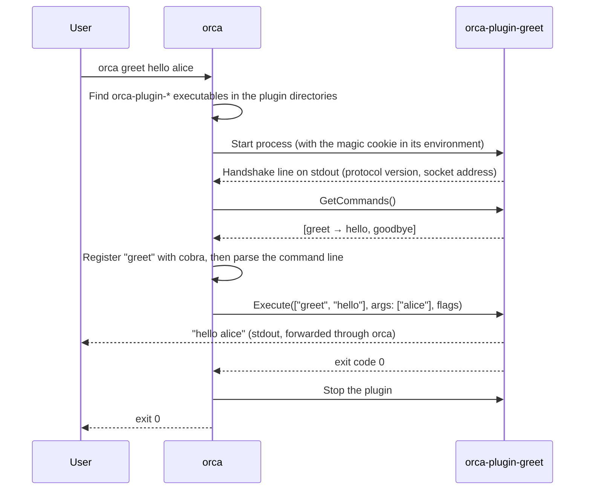

# How plugins work

This page explains orca's plugin system for anyone working on orca itself, or writing a plugin without the Go SDK. To write a plugin in Go, [Building a plugin](./building.md) is all you need.

Orca uses HashiCorp's [go-plugin](https://github.com/hashicorp/go-plugin), the library behind Terraform providers. Each plugin is a separate process, and orca talks to it over gRPC on a local socket.

## Lifecycle



1. **Discovery.** Before running any command, orca looks for executable files named `orca-plugin-*` in its [plugin directories](./index.md#plugin-directories).
2. **Start-up.** Orca starts each plugin, completes the go-plugin handshake, and calls `GetCommands`. A plugin that fails any of this is logged and skipped.
3. **Registration.** Each command spec becomes a cobra command, with its flags, and is added to orca's root command, unless its name clashes with an existing command. Orca's commands are all registered first, so built-in commands always win.
4. **Execution.** If the user ran a plugin command, orca calls `Execute` with the command's path, arguments and flag values. The plugin's stdout and stderr are streamed back and written to the terminal.
5. **Shutdown.** Orca stops every plugin before it exits. This happens through a single exit path (see `cmd/orca/exit.go`), and also covers fatal errors and SIGINT, SIGTERM and SIGHUP.

Plugins built with the Go SDK also watch their parent process. If orca dies without stopping them (SIGKILL, or a SIGPIPE from `orca ... | head`), the plugin is re-parented, notices its parent process ID has changed, and exits within 250ms.

## The protocol

### Handshake

| Setting | Value |
| ------- | ----- |
| Magic cookie | Environment variable `ORCA_PLUGIN`, set to the value in [`pkg/plugin/handshake.go`](https://github.com/adamkirk/orca/blob/main/pkg/plugin/handshake.go). A plugin started without it should refuse to run. |
| App protocol version | `1`. Plugins built for a different version fail the handshake and aren't loaded. |
| Transport | gRPC only (go-plugin's older net/rpc mode isn't supported). |

### Service

The service is defined in [`proto/orca/plugin/v1/plugin.proto`](https://github.com/adamkirk/orca/blob/main/proto/orca/plugin/v1/plugin.proto):

```proto
service CommandProvider {
  rpc GetCommands(GetCommandsRequest) returns (GetCommandsResponse);
  rpc Execute(ExecuteRequest) returns (ExecuteResponse);
}
```

| RPC | Purpose |
| --- | ------- |
| `GetCommands` | Returns the plugin's command tree (`CommandSpec`s, each with `FlagSpec`s and nested `subcommands`). Called on every orca run, so it should be fast. |
| `Execute` | Runs a leaf command. `command_path` identifies it, from the top-level command down, and `flags` holds every declared flag's value as a string. Returns an `exit_code`, and an optional `error` message for orca to print. |

The Go code generated from the proto file is committed in `pkg/plugin/proto/v1`. After changing the proto file, regenerate it with `make gen-proto`, and bump the app protocol version for any breaking change.

## Writing a plugin in another language

!!! warning "Untested"
    Only the Go SDK is supported and tested so far. The steps below follow go-plugin's design, so they should work, but expect rough edges.

Any language with gRPC support can implement a plugin. It needs to:

1. **Check the magic cookie.** Exit with an error unless `ORCA_PLUGIN` is set to the expected value.
2. **Implement `CommandProvider`**, generating the gRPC code from `plugin.proto`.
3. **Register the gRPC health service**, with the service `plugin` set to `SERVING`. go-plugin uses it to check the connection.
4. **Listen** on a Unix socket or a localhost TCP port.
5. **Print the handshake line** to stdout, then keep running:
    ```
    1|1|unix|/tmp/orca-plugin-xyz.sock|grpc
    ```
    That's go-plugin's core protocol version (always `1`), orca's app protocol version, the network type, the address, and `grpc`.
6. **Exit when orca goes away.** Orca normally stops plugins itself, but to avoid being orphaned if orca is killed, exit when your parent process changes, as the Go SDK does.

go-plugin's [guide to writing plugins in other languages](https://github.com/hashicorp/go-plugin/blob/main/docs/guide-plugin-write-non-go.md) covers steps 3–5 in more detail, with a Python example.

## Code map

| Path | Contents |
| ---- | -------- |
| `proto/orca/plugin/v1/plugin.proto` | The gRPC protocol. |
| `pkg/plugin/` | The public Go SDK: the `CommandProvider` interface, `Serve`, the handshake and the gRPC adapters. |
| `internal/plugins/` | Orca's side: discovery, starting and stopping plugins, and turning command specs into cobra commands. |
| `cmd/orca/plugins.go` | Registers plugin commands, and the `orca plugins` commands. |
| `cmd/orca/exit.go` | The exit and signal handling that makes sure plugins are always stopped. |
| `examples/plugins/hello/` | A minimal example plugin. |
